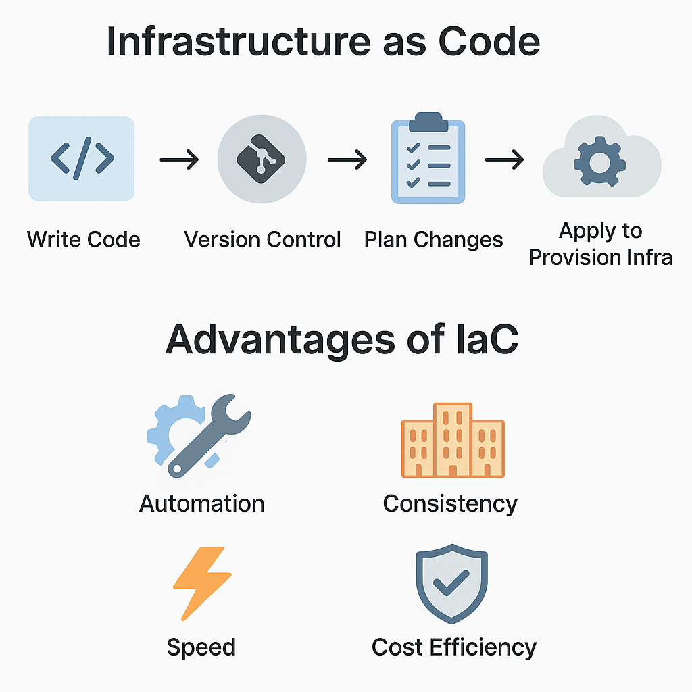

# Infrastructure as Code (IaC) and Its Advantages

---

## 📘 What is Infrastructure as Code (IaC)?

**Infrastructure as Code (IaC)** is a method to manage and provision IT infrastructure through machine-readable configuration files instead of manual hardware setup or point-and-click console interfaces.

It helps DevOps teams automate, standardize, and scale infrastructure reliably across multiple environments.

---

## ⚙️ Simple Flow of IaC

```text
Write Code (.tf or .yaml)
       ↓
Version Control (Git)
       ↓
Plan Changes (Terraform Plan)
       ↓
Apply to Provision Infra (Terraform Apply)
       ↓
Cloud Infrastructure Ready (AWS, Azure, GCP)
````

 <!-- Replace with actual path -->

---

## ✅ Advantages of IaC

| Advantage           | Description                                                             |
| ------------------- | ----------------------------------------------------------------------- |
| 🛠️ Automation      | Infrastructure is created automatically by executing code               |
| ✏️ Consistency      | Same code = same infrastructure across Dev, QA, and Prod                |
| ⚡ Speed             | Deploy full environments in minutes instead of days                     |
| ♻️ Reusability      | Use modules or templates to standardize infra across projects           |
| ⚖️ Version Control  | Code is version-controlled using Git, enabling rollback & audit history |
| 🔍 Traceability     | Changes are tracked and reviewed before being applied                   |
| 💸 Cost Efficiency  | Provision on-demand, destroy when not needed to save costs              |
| 🔐 Security & Audit | Git logs and RBAC ensure secure and traceable changes                   |

---

## 🌍 Real-Life Example (Terraform)

```hcl
resource "aws_instance" "example" {
  ami           = "ami-0c55b159cbfafe1f0"
  instance_type = "t2.micro"
}
```

This code spins up an EC2 instance in AWS via Terraform.

---

## 🎓 Use Case

**Scenario:**
Your team needs Dev, QA, and Production environments to be identical.

* Without IaC: Manual provisioning leads to configuration drift and errors.
* With IaC: Reuse the same code to quickly set up consistent environments.

---


