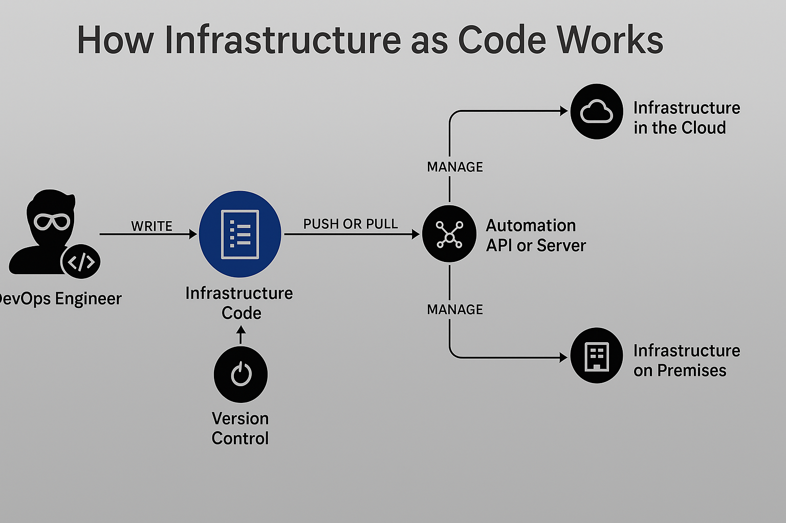

# How Infrastructure as Code (IaC) Works

Infrastructure as Code can be explained from a high level in **three simple steps**:

---

## 🔁 1. Write Infrastructure Code

DevOps engineers write the infrastructure specification using **domain-specific languages**, such as:

- Terraform  
- AWS CloudFormation  
- Pulumi  
- Azure Resource Templates  

These configuration files describe the **desired state** of the infrastructure: servers, networks, databases, etc.

---

## ⬆️ 2. Push or Pull Code to/from a Server/API

The written code is either:
- **Pushed** to a management server (Terraform Cloud, Jenkins, CI/CD pipeline), or  
- **Pulled** by it from a version-controlled repository (like GitHub).  

The platform uses APIs or SDKs from cloud providers to execute the code and provision infrastructure.

---

## ⚙️ 3. Platform Executes & Provisions Infrastructure

The automation platform:
- Interprets the infrastructure code  
- Provisions the defined resources to:
  - ☁️ **Infrastructure in the Cloud** (AWS, Azure, GCP)  
  - 🏢 **On-premises infrastructure** (VMware, Bare Metal, etc.)

It also manages:
- ✅ Dependency resolution  
- ✅ Resource creation order  
- ✅ Idempotency (avoids unnecessary resource recreation)

---

## 📊 Diagram Flow


 <!-- Ensure this path matches your repo structure -->

---

## 🛠️ Use Cases and Tools

| Use Case                  | Tools to Use                                                    |
| ------------------------- | --------------------------------------------------------------- |
| Infrastructure Management | Terraform, Pulumi, AWS CloudFormation, Azure Resource Templates |
| Configuration Management  | Ansible, Chef, Puppet (limited infra provisioning capabilities) |

---

## ✅ Summary

* IaC turns infrastructure into **repeatable, versioned, and testable** code.
* It reduces manual intervention and improves reliability.
* It works across **cloud** and **on-prem** environments using **automation tools**.

```

---

